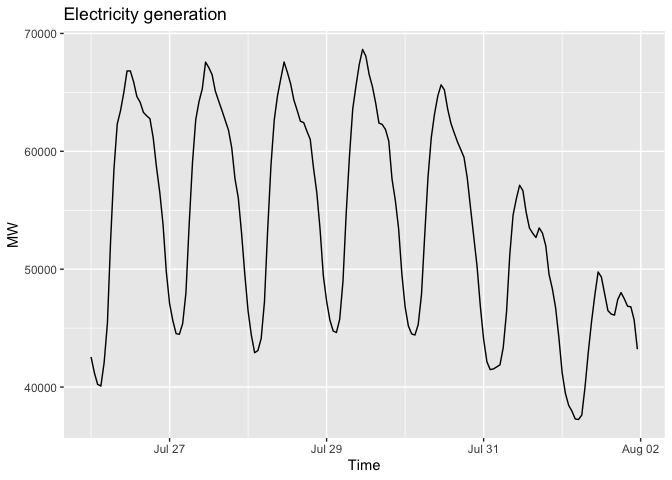

# bunddev 

An R interface to German government and public sector APIs listed on
[bund.dev](https://bund.dev). **33 ready-to-use adapters** return tidy
tibbles for immediate use in dplyr/ggplot2 workflows.

## Three-layer architecture

| Layer            | What it does                                | Entry point                                                                                                                                                                 |
|------------------|---------------------------------------------|-----------------------------------------------------------------------------------------------------------------------------------------------------------------------------|
| **Registry**     | Browse and search all APIs on bund.dev      | [`bunddev_list()`](https://buecker.ms/bunddev/reference/bunddev_list.md), [`bunddev_info()`](https://buecker.ms/bunddev/reference/bunddev_info.md)                          |
| **OpenAPI core** | Explore specs and call any endpoint         | [`bunddev_spec()`](https://buecker.ms/bunddev/reference/bunddev_spec.md), [`bunddev_call()`](https://buecker.ms/bunddev/reference/bunddev_call.md)                          |
| **Adapters**     | Ready-made functions returning tidy tibbles | e.g. [`smard_timeseries()`](https://buecker.ms/bunddev/reference/smard_timeseries.md), [`autobahn_roadworks()`](https://buecker.ms/bunddev/reference/autobahn_roadworks.md) |

Adapters include built-in response caching and rate limiting.

## Installation

Install the released version from CRAN:

``` r
install.packages("bunddev")
```

Or install the development version from GitHub:

``` r
remotes::install_github("mchlbckr/bunddev")
```

## Quick start

``` r
library(bunddev)

# Energy market data
series <- smard_timeseries(410, region = "DE", resolution = "hour")

# Weather warnings
dwd_warnings()

# Current news
tagesschau_homepage()

# Company search
handelsregister_search("deutsche bahn")

# Water levels
pegel_online_stations()

# Parliamentary documents
dip_bundestag_drucksache_list()
```

## Available adapters (33)

🏛️ **Government & Parliament** — bundestag, bundesrat,
bundestag_lobbyregister, dip_bundestag, bundeshaushalt

🌤️ **Environment & Weather** — dwd, luftqualitaet, hochwasserzentralen,
pegel_online, mudab, smard

📊 **Statistics & Data** — destatis, deutschlandatlas, regionalatlas,
dashboard_deutschland

💼 **Jobs & Education** — jobsuche, ausbildungssuche, bewerberboerse

🚗 **Transport & Infrastructure** — autobahn, ladestationen, eco_visio

🚨 **Safety & Alerts** — nina, lebensmittelwarnung, travelwarning,
pflanzenschutzmittelzulassung

🏥 **Health** — diga, hilfsmittel

📰 **Culture & Media** — tagesschau, ddb

🏢 **Business** — handelsregister, marktstammdaten

📅 **Other** — abfallnavi, feiertage

## Examples

### Browse the registry

``` r
library(bunddev)

bunddev_list(tag = "energy")
#> # A tibble: 3 × 8
#>   id              title        provider spec_url docs_url auth  rate_limit tags 
#>   <chr>           <chr>        <chr>    <chr>    <chr>    <chr> <chr>      <lis>
#> 1 ladestationen   Ladesaeulen… Bundesn… https:/… https:/… none  <NA>       <chr>
#> 2 marktstammdaten Marktdatens… Bundesn… https:/… https:/… none  <NA>       <chr>
#> 3 smard           SMARD API    Bundesn… https:/… https:/… none  Mehr als … <chr>
```

### German public holidays

``` r
feiertage_list(2025)
#> # A tibble: 190 × 5
#>    region holiday                   date       note          date_time          
#>    <chr>  <chr>                     <chr>      <chr>         <dttm>             
#>  1 BW     Neujahrstag               2025-01-01 ""            2025-01-01 00:00:00
#>  2 BW     Heilige Drei Könige       2025-01-06 ""            2025-01-06 00:00:00
#>  3 BW     Karfreitag                2025-04-18 ""            2025-04-18 00:00:00
#>  4 BW     Ostermontag               2025-04-21 ""            2025-04-21 00:00:00
#>  5 BW     Tag der Arbeit            2025-05-01 ""            2025-05-01 00:00:00
#>  6 BW     Christi Himmelfahrt       2025-05-29 ""            2025-05-29 00:00:00
#>  7 BW     Pfingstmontag             2025-06-09 ""            2025-06-09 00:00:00
#>  8 BW     Fronleichnam              2025-06-19 ""            2025-06-19 00:00:00
#>  9 BW     Tag der Deutschen Einheit 2025-10-03 ""            2025-10-03 00:00:00
#> 10 BW     Reformationstag           2025-10-31 "Gemäß § 4 A… 2025-10-31 00:00:00
#> # ℹ 180 more rows
```

### Autobahn roadworks

``` r
roads <- autobahn_roads()
roads
#> # A tibble: 110 × 1
#>    road_id
#>    <chr>  
#>  1 A1     
#>  2 A2     
#>  3 A3     
#>  4 A4     
#>  5 A5     
#>  6 A6     
#>  7 A7     
#>  8 A8     
#>  9 A9     
#> 10 A10    
#> # ℹ 100 more rows

roadworks <- autobahn_roadworks(roads$road_id[[1]])
roadworks
#> # A tibble: 181 × 18
#>    road_id identifier        title subtitle display_type icon  is_blocked future
#>    <chr>   <chr>             <chr> <chr>    <chr>        <chr> <lgl>      <lgl> 
#>  1 A1      2026-002514--vi-… A1 |… " Saarb… ROADWORKS    123   FALSE      FALSE 
#>  2 A1      2026-004710--vi-… A1 |… " Trier… SHORT_TERM_… warn… FALSE      FALSE 
#>  3 A1      2024-004256--vi-… A1 |… " Saarb… ROADWORKS    123   FALSE      FALSE 
#>  4 A1      2024-004156--vi-… A1 |… " Saarb… ROADWORKS    123   FALSE      FALSE 
#>  5 A1      2024-038925--vi-… A1 |… " Saarb… ROADWORKS    123   FALSE      FALSE 
#>  6 A1      2024-004156--vi-… A1 |… " Saarb… ROADWORKS    123   FALSE      FALSE 
#>  7 A1      2024-038925--vi-… A1 |… " Saarb… SHORT_TERM_… warn… FALSE      FALSE 
#>  8 A1      2024-004156--vi-… A1 |… " Köln/… ROADWORKS    123   FALSE      FALSE 
#>  9 A1      2024-004156--vi-… A1 |… " Köln/… ROADWORKS    123   FALSE      FALSE 
#> 10 A1      2024-038925--vi-… A1 |… " Köln/… ROADWORKS    123   FALSE      FALSE 
#> # ℹ 171 more rows
#> # ℹ 10 more variables: start_timestamp <chr>, start_time <list>, point <chr>,
#> #   extent <chr>, coordinate_lat <chr>, coordinate_long <chr>,
#> #   description <chr>, footer <chr>, route_recommendation <list>,
#> #   lorry_parking_feature_icons <list>
```

### SMARD energy data with ggplot2

``` r
library(ggplot2)

series <- smard_timeseries(410, region = "DE", resolution = "hour",
                           timestamp = 1627250400000)
series
#> # A tibble: 168 × 3
#>        timestamp time                 value
#>            <dbl> <dttm>               <dbl>
#>  1 1627250400000 2021-07-26 00:00:00 42555 
#>  2 1627254000000 2021-07-26 01:00:00 41226.
#>  3 1627257600000 2021-07-26 02:00:00 40234.
#>  4 1627261200000 2021-07-26 03:00:00 40087.
#>  5 1627264800000 2021-07-26 04:00:00 42084.
#>  6 1627268400000 2021-07-26 05:00:00 45420.
#>  7 1627272000000 2021-07-26 06:00:00 52580.
#>  8 1627275600000 2021-07-26 07:00:00 58492.
#>  9 1627279200000 2021-07-26 08:00:00 62314 
#> 10 1627282800000 2021-07-26 09:00:00 63444 
#> # ℹ 158 more rows

ggplot(series, aes(time, value)) +
  geom_line() +
  labs(x = "Time", y = "MW", title = "Electricity generation")
```



`series$time` is a POSIXct column parsed in Europe/Berlin.

### DIP Bundestag parliamentary data (requires API key)

``` r
library(bunddev)

# List recent documents
docs <- dip_bundestag_drucksache_list(params = list(
  f.datum.start = "2025-01-01",
  f.drucksachetyp = "Gesetzentwurf"
))

# Get details for a specific document
dip_bundestag_drucksache(284229)

# Full text (includes text column)
dip_bundestag_drucksache_text(284229)
```

### Jobsuche (requires API key)

``` r
library(bunddev)

Sys.setenv(JOBBOERSE_API_KEY = "jobboerse-jobsuche")
bunddev_auth_set("jobsuche", type = "api_key", env_var = "JOBBOERSE_API_KEY")

jobs <- jobsuche_search(params = list(was = "data", size = 5), flatten = TRUE)
```

### Discover parameters from OpenAPI specs

``` r
bunddev_parameters("smard")
bunddev_parameter_values(smard_timeseries, "resolution")
```

## Related projects

| Language | Package     | Repository                                                        |
|----------|-------------|-------------------------------------------------------------------|
| Python   | deutschland | [bundesAPI/deutschland](https://github.com/bundesAPI/deutschland) |
| Perl     | WWW::Bund   | [Getty/p5-www-bund](https://github.com/Getty/p5-www-bund)         |

## Acknowledgements

This package builds on the work of the [bund.dev](https://bund.dev) team
and the [bundesAPI](https://github.com/bundesAPI) community, who curate
and document public sector APIs.
